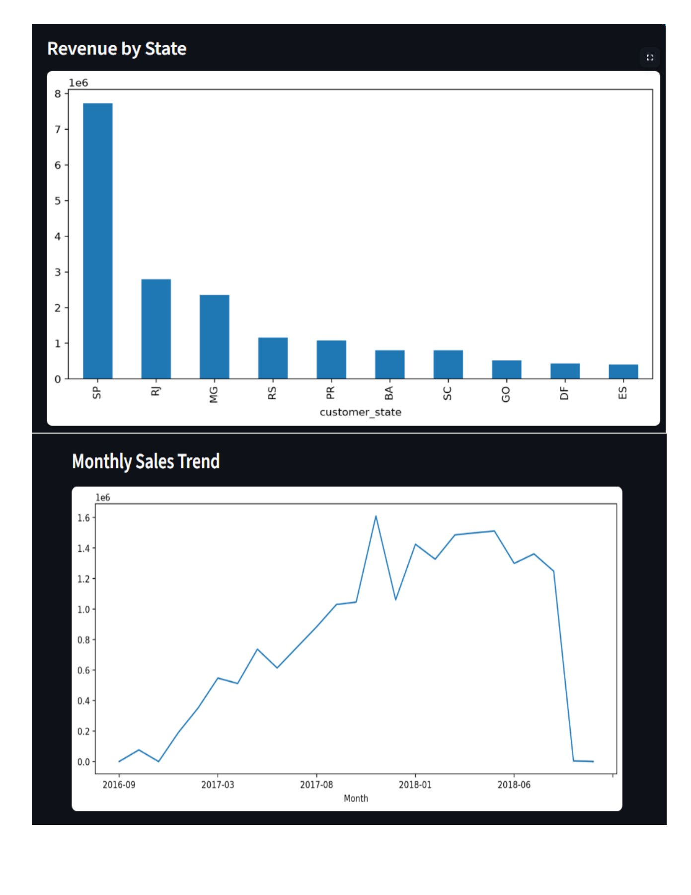
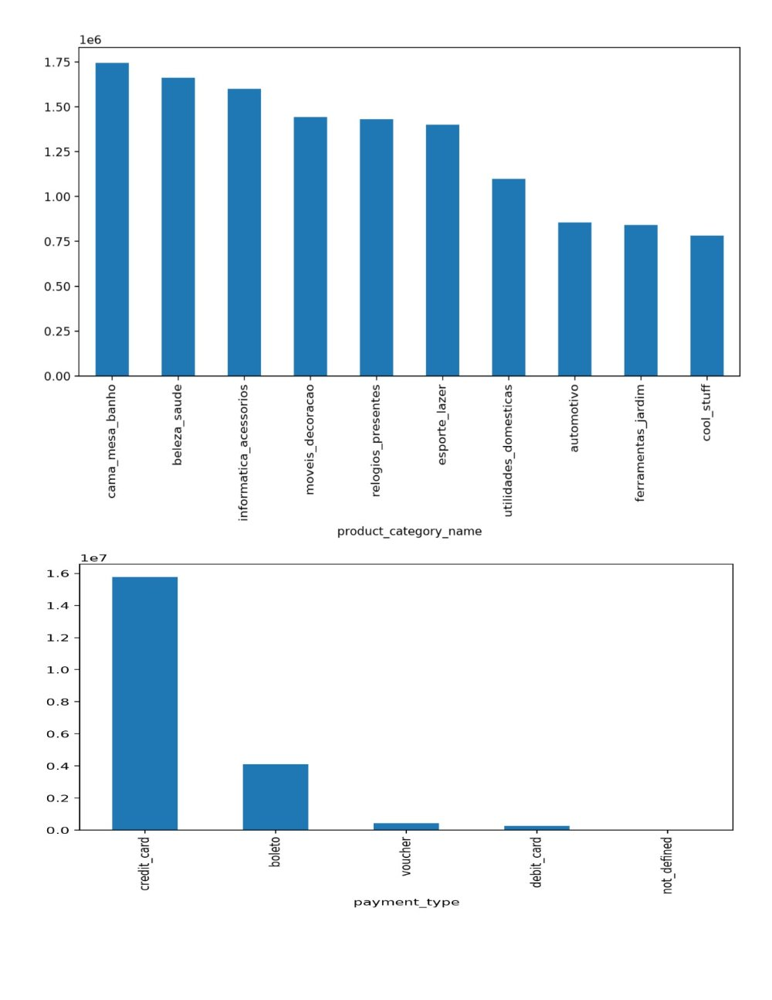
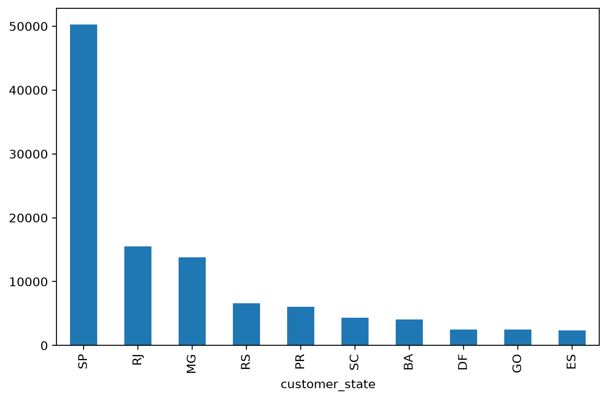
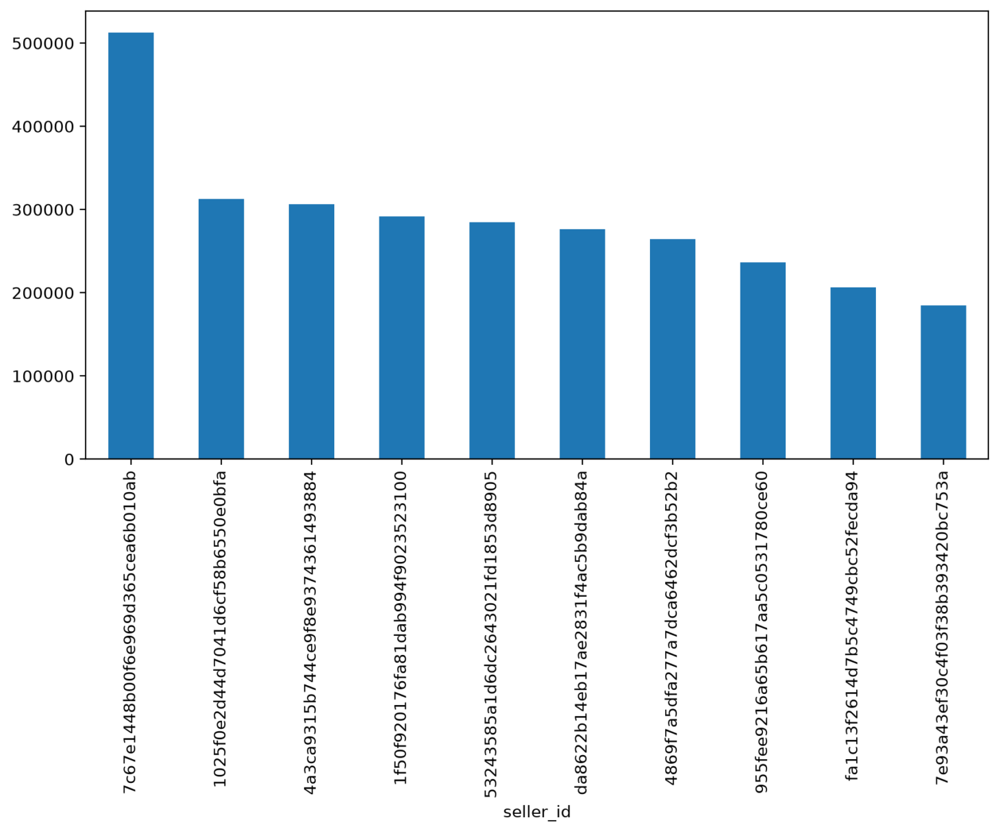
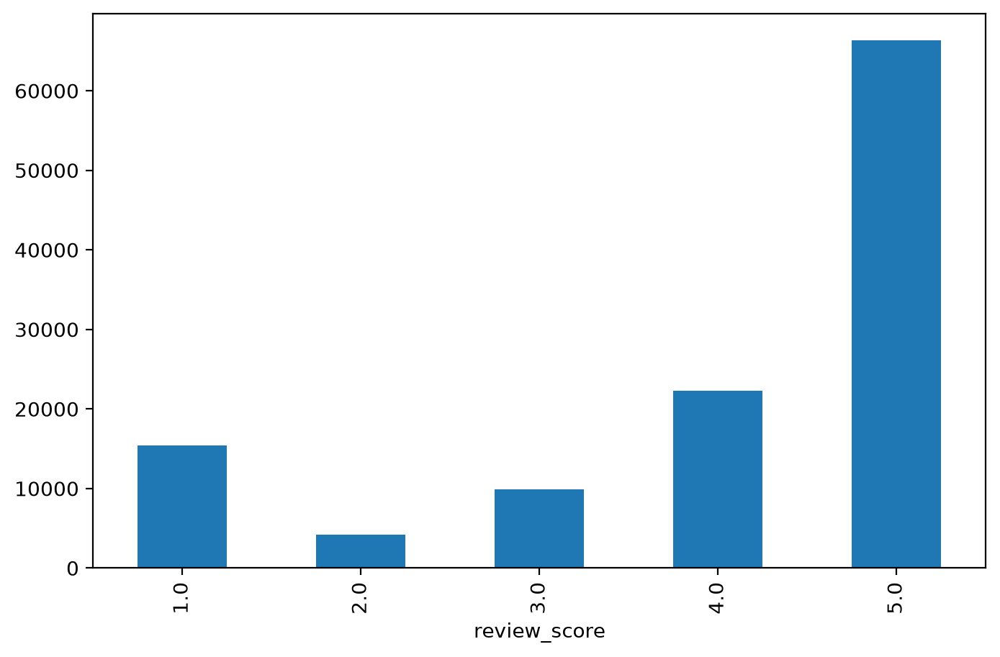

# 📊 E-Commerce Executive Analytics Dashboard

## 🚀 Overview

This project is an end-to-end Data Analytics solution built using Python, Pandas, Streamlit, and Machine Learning.

It analyzes over 99,000 e-commerce orders to provide business insights through an interactive executive dashboard.

---

## 🎯 Project Objectives

- Clean and transform raw business data
- Perform exploratory data analysis (EDA)
- Build an interactive dashboard
- Analyze customer behavior
- Analyze sales performance
- Predict customer reviews using Machine Learning

---

## 📊 Dashboard Features

- 📈 Executive KPIs
- 💰 Revenue Analysis
- 👥 Customer Analysis
- 🏪 Seller Analysis
- ⭐ Review Analysis
- 🤖 Machine Learning Prediction

---

## 🛠 Technologies Used

- Python
- Pandas
- NumPy
- Matplotlib
- Streamlit
- Scikit-learn
- Git
- GitHub

---

## 📂 Project Structure

ecommerce-analytics/
│
├── dashboards/
├── data/
├── images/
├── notebooks/
├── reports/
├── requirements.txt
├── README.md
└── .gitignore

---

## 📸 Dashboard Screenshots

### Executive Dashboard

### Sales Analysis

### Customer Analysis

### Seller Analysis

### Review Analysis

### Machine Learning

---

## 📈 Machine Learning

Model:
- Random Forest Classifier

Accuracy:
- **73.9%**

---

## 📌 Business Insights

The dashboard helps identify:

- Highest revenue states
- Preferred payment methods
- Customer review patterns
- Monthly sales trends
- Seller performance

---

## 🚀 Future Improvements

- Power BI Dashboard
- Sales Forecasting
- Customer Segmentation
- Deep Learning Models
- Cloud Deployment

---

## 👨‍💻 Author

**Solomon Sam**

Aspiring Data Analyst | Python | SQL | Power BI | Machine Learning